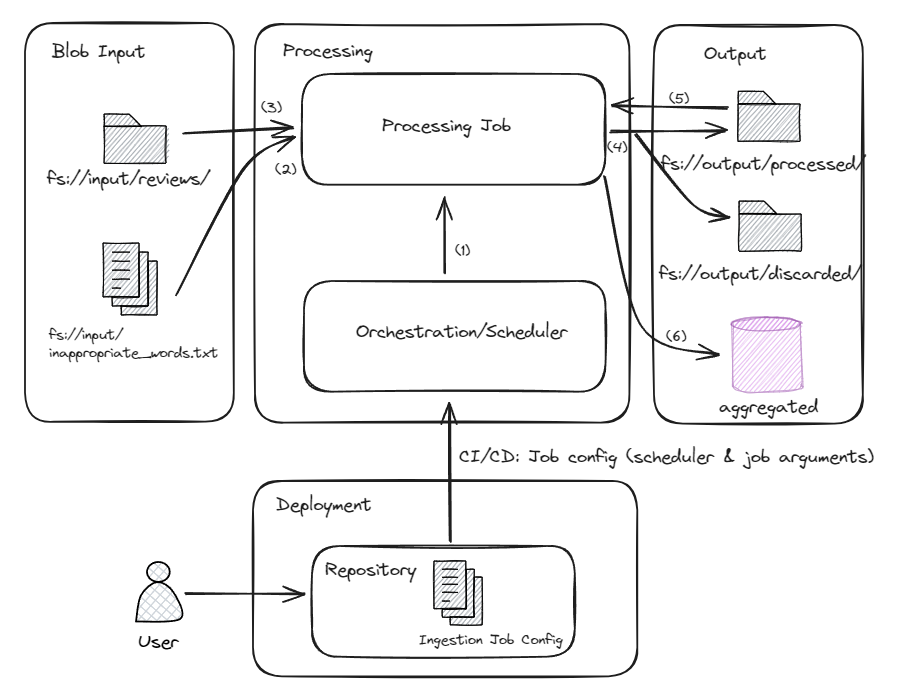
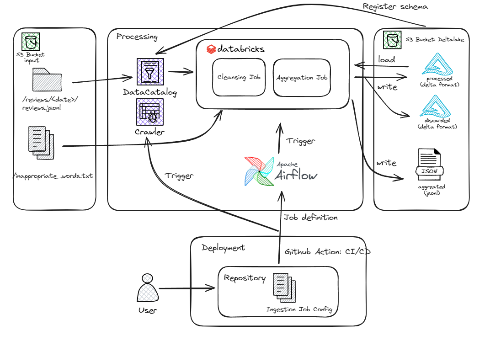

# Design Document - Review Ingestion System
## Introduction
As the company possesses a vast collection of restaurant reviews, the Product department requires that these data be ingested and stored, and presented to management in the form of summary statistics.

### Problem Statement
Design a Review Ingestion System that is responsible for processing data input from a blob storage, filtering out inappropriate words and outdated reviews, and delivering aggregated metrics to the Product department.

The Product department requests that we deliver the following aggregated metrics:

* Number of reviews
* Average score
* Average length of review
* Review age (in days)
  * Oldest
  * Newest
  * Average

## Requirements
* System can get the reviews record from blob storage, process, and stored back into other dedicated blob storage
* Input: review input uploaded into a BLOB storage system with following criteria:
  * Review uploaded in JSONL format
  * Minimum frequency of arrival is 1 day
  * File size may not fit typical computer memory (>16BG?)
  * Record may contain duplicate
  * Incoming file can't be considered full import
  * The incoming reviews might not adhere to the specified JSON schema.
  * Reviews may be updated over time
  * All review are in English
* Process: review are expected to be processed by filtering out inappropriate words and outdated reviews with following detail:
  * Replace inappropriate words with asterisks (“****”). 
  * The list of inappropriate words is provided in the same BLOB storage system in a dedicated bucket/namespace as a one-word-per-line UTF-8 encoded txt file and independent of deployment.
  * If review contains too many inappropriate words (>= 20% of overall text), need to discarded entirely.
  * Deduplicate review based on unique id
  * Standarize review format based on [Review JSON schema](schemas/review.json).
  * Review is outdated if it is more than 3 years old from the date of processing.
  * Process aggregated metrics as requested by the product department above, and must adhere to the [Aggregations JSON schema](schemas/aggregation.json).
* Output: cleaned, discarded, and aggregated data, with detail:
  * The processed reviews must be written to a dedicated bucket/namespace of BLOB storage system using a date(time) prefix.
  * Discarded reviews should also be written to another dedicated bucket/namespace of your BLOB storage system.
  * Aggregated metrics must also be written to a dedicated bucket/namespace of BLOB storage using a date(time) prefix based on processing date.
* Ingestion system need to scale by following dimension:
  * Input file size
  * Frequency of input arrival
  * Number of job (there may be more than 1 ingestion job, and should be set up and scale easily)

## Solution

### Design Decisions
Generally the main component of the ingestion system are:
1. Input & Output blob storage & database/datawarehouse
2. Processing component:
   - Orchestration/scheduler: responsible with orchestrating job schedule and job definition
   - Processing job: responsible with read, load, and transform data

Having separate orchestration and processing components was chosen to accommodate for the need for high-resource, one-off transformation jobs. While the orchestration component, responsible with job scheduling and definition, requires lower resource intensity but requires high availability. This way job can be scaled properly and high resource computing will only be required once the processing job is triggered. 

The processing job, once triggered, can leverage a scalable, on-demand job that will scale to the number of jobs and be cost-efficient.

Additionally, job & scheduling config can be part of deployment operations, in which the argument can be defined within the repository and propagated to the ingestion system through CI/CD process.

With that, this is the general design of data flow diagram agnostic to the cloud service of choice:

The flow numbering are explained below:
1. Scheduler trigger processing job at defined interval including the argument required to the job.
2. Processing job read the list of inappropriate words from the input blob storage.
3. Processing job read the new reviews input from the input blob, and start the data cleansing process.
4. Cleaned data (deduplicated, standarised, and cencored) stored in fs://output/processed blob storage, and discarded data in fs://output/discarded. 
5. Cleaned data wil be reprocessed for aggregation
6. Aggregated data stored in DB/DWH/Datalake of choice

**Other Consideration**
* At flow no.3, there must be a mechanism to detect new data:
  * For this implementation, consider the simplest approach by assuming data input to be stored based on uploaded date, and processing job will always read the data for the last N days from data processing date (N should be part of the job argument), assuming there always be deduplication process.
  * Other option is to move processed file into different place. --> This is preferable choice if the data input per upload is insanely big that it make a noticable difference in cost, but will require more crafting. 
  * Other option is to trigger job not based on scheduler but based on the event detection when new file is arrived --> will require design change
* At flow no. 4: 
  * The write should consider incremental loading to the cleaned data, so it can be scalable to process incomplete data, duplicated record, and be more efficient as the input before aggregation (no need another round of deduplication)
  * Data could be written with columnar format (parquet, orc, etc) and possibly compressed to make efficient read for data aggregation.
  * Data should be partitioned by date, so aggregation can read the data efficiently given the requirement to only process rolling 2 year worth of data.

### Architecture Decision
The architecture will use single cloud solution to make egress & ingress traffic be more cost efficient and the network can be contained inside an isolated VPC. For this, AWS will be the cloud provider of choice.

#### Processing
* **Orchestration component** will be using **Apache Airflow** with multiple worker pod (managed by kubernetes), so it can scale based on the required number of jobs. Alternatively, to use **Amazon MWAA** (Managed Workflow for Apache Airflow) to reduce operational burden.
* **Processing component** will consider to use **Databricks** deployed in AWS to manage spark job, as managing spark job by self hosted solution may introduce too much of operations overhead. Alternatively can also use **AWS Glue**. Additionally:
  * Processing job should be separated into cleaning & aggregation process so it can be managed independently. The two process can be connected by building an airflow DAG.
  * Data processing can use custom python logic using pyspark, so all the requirement of cencoring, deduplication, and cencoring data can be applied easily. And it can also cover more complex ingestion logic in the future.

#### Data Storage and Database
* **Input data storage** will use **Amazon S3**, as we use spark based processing, external table can be created to natively query files through spark instead of manually specifying data path.
* **Glue Catalog** & **Crawler** will be used to manage raw table schema metadata. Alternatively to use spark job in python to create external table metadata based on the json scheme contract in reviews.json.
* **Output** will be stored in **Deltalake** and **delta format** and to use **Amazon S3** as the blob storage, for all processed, discarded, and aggregated, for the reason:
  * It ACID compliance which allow the data to be deleted, updated, and merged. This mean it satisfy our requirement to do the incremental loading.
  * While it can act as datawarehouse, the data is stored in Hive style partitioning format which satisfy the requirement fo have date/time prefix.
  * Data can be partitioned based on date, exactly satisfy our requirement.

#### Architecture Diagram
The general outline of the architecture can be seen below. Some additional functionallity as the concequencies of using delta format is to have somewhere to regiser the table schema, in this case glue data catalog is used.

### Deployment & Scaling Strategy
#### Deployment
* Architecture deployment can be managed using Terraform, to make sure the architecture provisioning to be stateless. The terraform deployment should be done separately as job deployment, can be simply hosted inside the same repository but with independent github action. This should also control resource management (how many airflow pod, etc)
* Ingestion job deployment should mainly use config yaml file to manage each individual ingestion job, in this case the yaml should contain both job and scheduling argument:
   * Scheduling argument: frequency, start_date, end_date
   * Job argument: 
      * n_days_processing: how many days far back processing should be done
      * input_path: path of the input review path
      * inappropriate_words_path: path of the inappropriate_words.txt
      * output_args: output_path, output_table_name, aggregated_output_path, aggregated_output_table_name
      * resource: instance_size, databrick job arguments
   
   NB: Argument may evolve during the implementation, but for each every new version should not break the old jobs. 
* To make config based deployment works, framework building block should also be build which has following functionality:
   * Create and deploy dag script to airflow.
   * Spark job processing template that will pick-up config file argument and process data based on the config. Including read/write data which adhere to the provided schme/data contract.
   * Script to trigger Crawler & schema registry

#### Scaling Strategy
Above design mostly has consider the job to scale, but to give the outline of scaling strategy:
* Config based Ingestion process, every new ingestion should be created by simple config yaml file. No need to build custom/python script everytime.
* Airflow scaled by multiple worker pod, which can be upscale/downscaled based on terraform config files. Will be adjusted based on the number of job requirements
* One-off spark based job using Databricks job. As this horizontally scaled and theoritically can run multiple job at once as every spark job will run in isolated cluster.
* The heavy-read data are stored in delta format, which are ACID compliant and very efficient for aggregation usecase given the columnar format.
* Storage <> compute decoupling, so there will be no DB locking conflict between job (as long as it write from different delta table)
